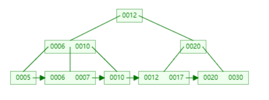

可以参考B+树在线演示网站：
[B+树在线演示](https://www.cs.usfca.edu/~galles/visualization/BPlusTree.html)

添加key及值后：
```java
        bPlusTree.insert(10, "Value10");
        bPlusTree.insert(20, "Value20");
        bPlusTree.insert(5, "Value5");
        bPlusTree.insert(6, "Value6");
        bPlusTree.insert(12, "Value12");
        bPlusTree.insert(30, "Value30");
        bPlusTree.insert(7, "Value7");
        bPlusTree.insert(17, "Value17");
```

可能的打印结果为：


删除key：
```java
    bPlusTree.delete(6);
    bPlusTree.delete(10);
```
可能的打印结果为：

